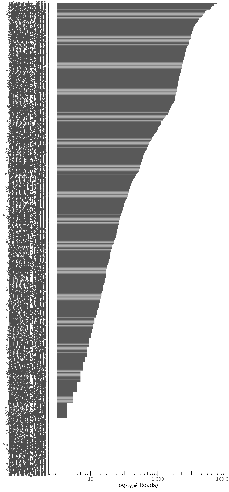
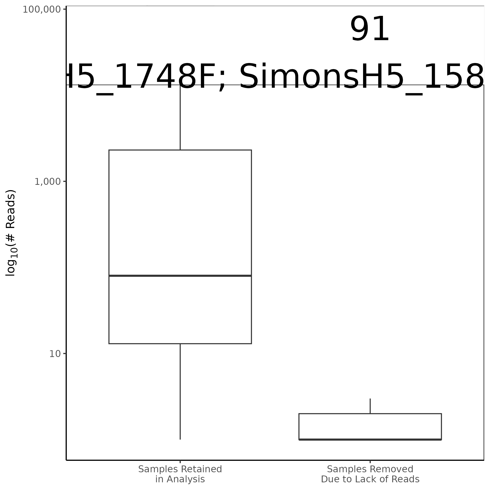
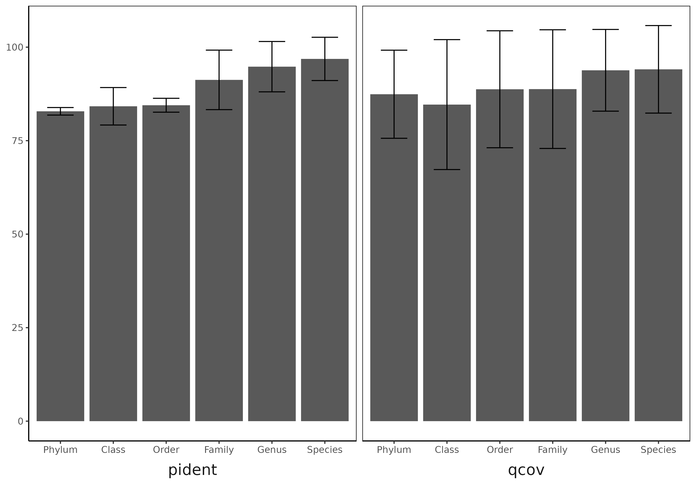
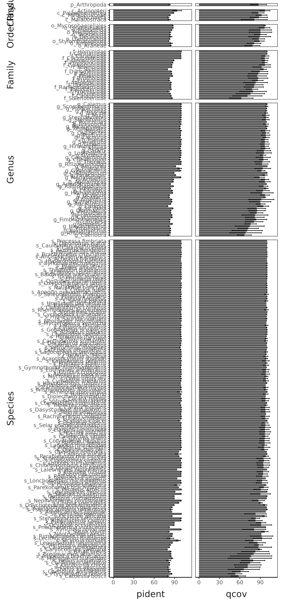
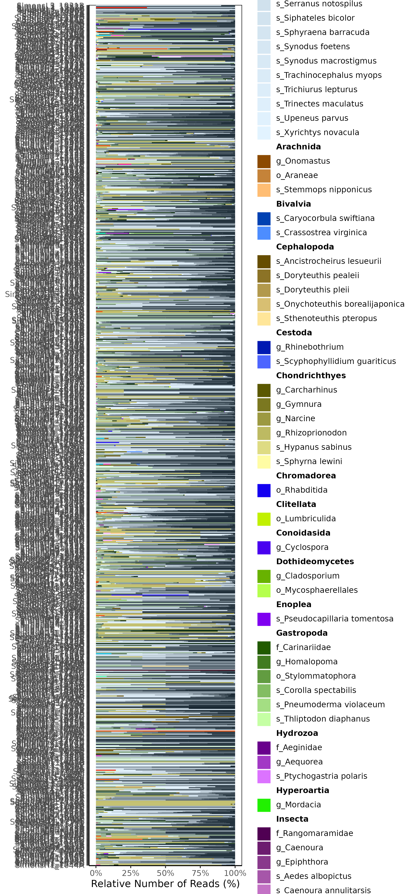
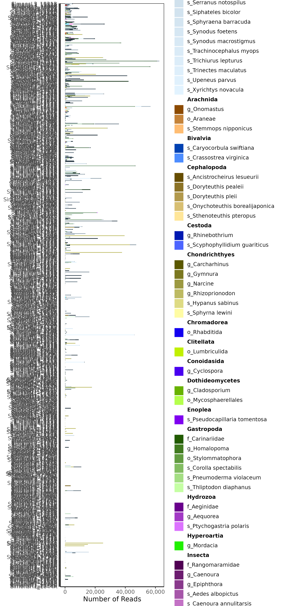

#prj-name
PROJECT DESCRIPTION  - ADJUST

path to repo in Launch supercomputer `XXX`  - ADJUST

---

eDNA data has been processed with [rainbow_bridge](https://github.com/mhoban/rainbow_bridge) a fork of [eDNAFlow](https://github.com/mahsa-mousavi/eDNAFlow)

Repo Structure:

* data (Original Fastq sequence files with metadata and sample-mapping files - stored using [DVC](https://dvc.org/))
* [scripts](scripts) (Scripts and code used to analyze data)
* intermediate_files (modified fastq if any, along with rainbow_bridge working outputs - not tracked, reproducable with data and scripts)
* [output](output) (Results)

All commands run in directory: [commands_run.md](commands_run.md)

---

## Data

DESCRIBE_DATA - ADJUST

Data files:

* [`data/*R[12]_[0-9]{3}.fastq.gz`]() - ADJUST

Parameter files:

* [metabarcode_rainbowbridge_paired.yml](metabarcode_rainbowbridge_paired.yml)
* [paired_demuxed_barcode.tsv](paired_demuxed_barcode.tsv) - ADJUST
* [sample.map](sample.map)
* [metadata.csv](metadata.csv)

## Protocol 
NOT DONE YET - TO EDIT

1. Files were downloaded from the TAMUCC grid via [`scripts/gridDownloader.sh`](scripts/gridDownloader.sh) using the link: [``]() - ADJUST

2. The integrity of the fastq format was then checked with [`scripts/checkFQ.sh`](scripts/checkFQ.sh) and [`scripts/validateFQPE.sbatch`](scripts/validateFQPE.sbatch)

3. Classified into zOTUs, classified to the lowest taxonomic level, and counted occurances in samples with [`scripts/run_rainbowBridge.sh`](scripts/run_rainbowBridge.sh)

	- Classifications are derived from the [MIDORI2 Unique Species database](https://www.reference-midori.info/index.html) and based on a weighted lowest common ancestor (LCA) algorithm which works by:
	
		```
		For each unique zOTU & each unique BLAST Hit (sequence ID) collapse to a single unique zOTU & BLAST Hit:
			- Selecting the first value for non-numeric fields (taxid to domain, length to slen, gapopen to stitle).
			- Taking the maximum value for pident, bitscore, qcov, and qcovhsp.
			- Taking the minimum value for mismatch and evalue.
		Remove BLAST hits to zOTUs below the minimum query coverage and percent identity
			- Will remove zOTUs with no BLAST Hits above the thresholds
		For each zOTU & each TaxaID:
			- Count number of BLAST hits
		For each zOTU: 		
			- Calculate percent identity difference between each blast hit and the highest percent identity BLAST hit within that zOTU
			- Remove hits with the difference greater than a maximum allowable difference
		Score each TaxaID based on the number of unique hits to the zOTU divided by the total number of unique sequences for that TaxaID in the database
			- Normalized to sum to 1
			- If any score >0.8 (scale 0-1) assign classification. Otherwise move up a taxonomic level and repeat the process.
		```
		
---

## Classification and Database Caveats 
* Incomplete Reference Sequences: The Midori2 database, like other reference databases, relies on curated sequences submitted by researchers. Some taxa, especially rare, cryptic, or poorly studied groups, may be underrepresented or entirely absent.

* Sequence Misannotations: Errors in the annotation of sequences (e.g., incorrect species or genus assignments) can propagate through analyses and lead to incorrect taxonomic identifications.

* Bias Toward Model or Economically Important Species: The database may be skewed toward species of greater economic or scientific interest, leaving gaps in representation for other taxa.

## Results

### Sequencing QC
[Pre-Filtering](output/fastqc/initial/multiqc_report.html) - Must download to view if repo is private, otherwise this will render [Pre-Filtering](https://html-preview.github.io/?url=https://github.com/tamucc-gcl/CHANGEREPO/blob/master/output/fastqc/initial/multiqc_report.html) - ADJUST

[Post-Filtering](output/fastqc/filtered/multiqc_report.html) - Must download to view if repo is private, otherwise this will render [Post-Filtering](https://html-preview.github.io/?url=https://github.com/tamucc-gcl/CHANGEREPO/blob/master/output/fastqc/filtered/multiqc_report.html) - ADJUST

|  |
|:--:| 
| Number of Reads sequenced (x-axis - log<sub>10</sub> transformed) in each sample (y-axis). The red vertical line indicates the median number of reads. Download Table with number of reads in each sample [here](output/rainbow_bridge/sample_sequencing_summary.csv). |

|  |
|:--:| 
| Boxplot comparing the number of reads in samples removed due to lack of reads to those which were kept for subsequent analysis. The numbers show the number of samples in each category with the sample names for samples removed for low numbers of sequences underneath. |

### Metabarcoding Process

|  |
|:--:| 
| Average (and standard error) pident (left) and qcov(right) values for all BLAST hits which passed filters specifed in the [parameters](metabarcode_rainbowbridge_paired.yml) at the lowest classification level of each zOTU. |

|  |
|:--:| 
| Average (and standard error) pident (left) and qcov(right) values for all BLAST hits which passed filters specifed in the [parameters](metabarcode_rainbowbridge_paired.yml) for each unique lowest taxonomic classification. |


### Metabarcoding Results
[Parameter Settings](metabarcode_rainbowbridge_paired.yml)

| Taxonomic Composition across all samples by number of: | reads | zOTUs |
|:--:|:--:|:--:|
| Download to View | [Read Composition](output/rainbow_bridge/taxonomy_nReads.html) | [zOTU Composition](output/rainbow_bridge/taxonomy_nZOTU.html) |

|  |  |
|:--:| :--:| 
| Taxonomic Composition of each sample (x-axis, percentage of classified reads) in each sample (y-axis, sorted by the number of reads) showing the lowest taxonomic classification of each zOTU based on the LCA algorithm using these [parameters](metabarcode_rainbowbridge_paired.yml). In the legend the letter preceeding the taxon name indicates the taxonomic level (i.e. "g_" indicates genus level identification). | Taxonomic Composition of each sample (x-axis, number classified reads) in each sample (y-axis, sorted by the number of reads) showing the lowest taxonomic classification of each zOTU based on the LCA algorithm using these [parameters](metabarcode_rainbowbridge_paired.yml). In the legend the letter preceeding the taxon name indicates the taxonomic level (i.e. "g_" indicates genus level identification). |

### Download Metabarcoding Results for Further Analysis
| | zOTU Table | zOTU Sequences | Phyloseq RDS | Lowest Taxa Table |
|:--|:--:|:--:|:--:|:--:|
| File | [zOTU x Sample Table](output/rainbow_bridge/zotu_table.csv) | [zOTU sequences](output/rainbow_bridge/zotu_sequences.fasta) | [Phyloseq Object](output/rainbow_bridge/phyloseq.rds) | [Lowest Taxonomic Classification x Sample Table](output/rainbow_bridge/lowest_taxonomy_table.csv) |
| File Type | Comma Seperated Value (csv) | FASTA file | R Data Structure (rds) | Comma Seperated Value (csv) |
| Description | Each row contains a unique zOTU with the number of reads in each sample (also contains zOTU taxonomy information) | Sequence and Taxonomic Information for each zOTU | Data File containing taxonomy and zOTU x Sample counts used by many R packages | Each row contains the lowest taxonomic classification with the number of reads in each sample |
| Metadata | [Column Descriptions](output/rainbow_bridge/zotu_table_metadata.txt) |  | [file format guide](https://www.bioconductor.org/packages/release/bioc/vignettes/phyloseq/inst/doc/phyloseq-basics.html) | [Column Descriptions](output/rainbow_bridge/lowest_taxonomy_table_metadata.txt) |

Download all intermediate analysis files [here]()- ADJUST